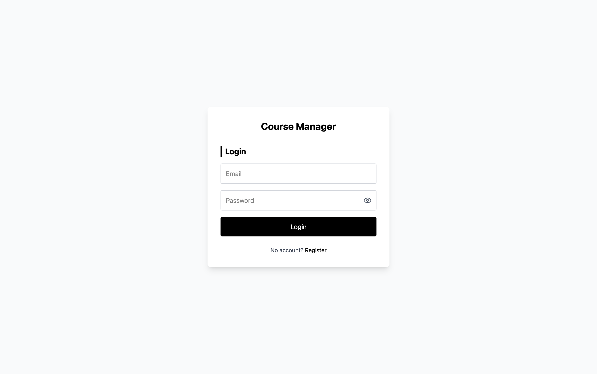
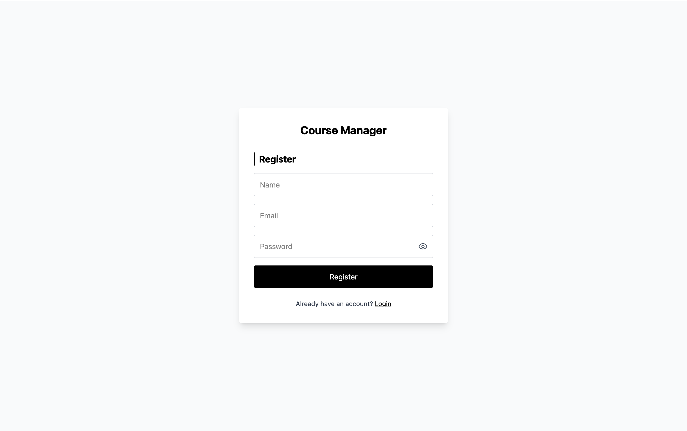
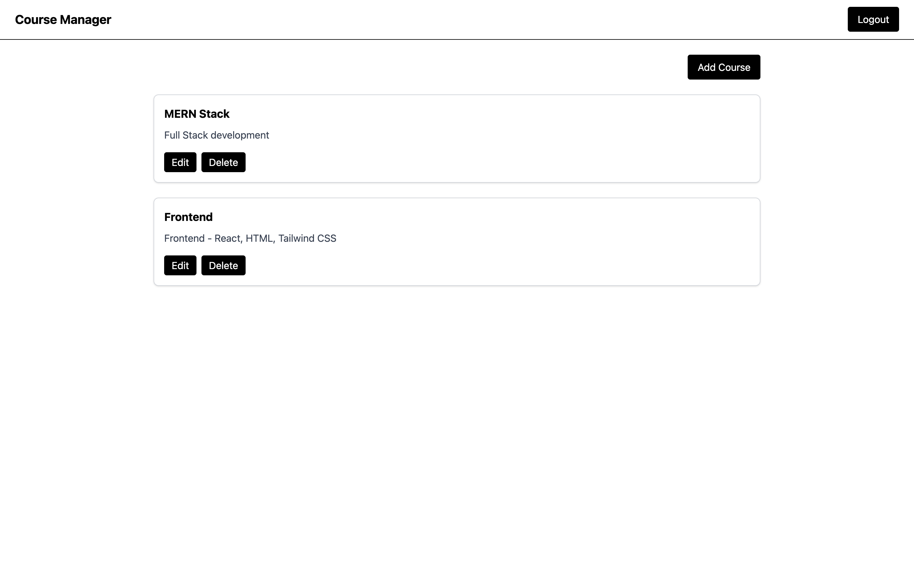
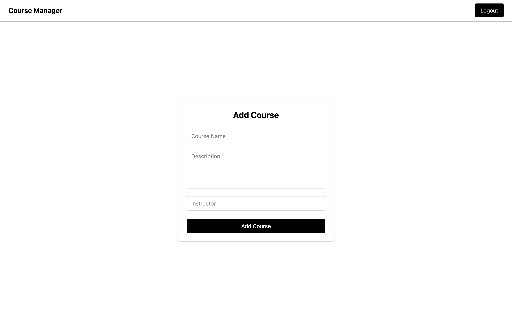
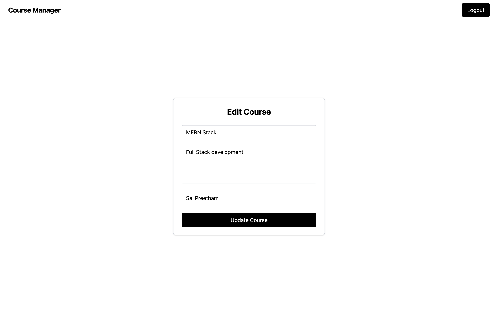

# 📘 Course Management Application

## 🔗 Hosted Links

**Frontend (Vercel):**
👉 [https://course-management-theta.vercel.app/](https://course-management-theta.vercel.app/)

**Backend (Render):**
👉 [https://course-backend-48p8.onrender.com](https://course-backend-48p8.onrender.com)

---

## 🧑‍💻 GitHub Repository

**Repository:**
👉 [https://github.com/saipreethambathula/course-management](https://github.com/saipreethambathula/course-management)

### 📁 Project Structure

```
course-management-app/
├── frontend/
│   ├── src/
│   ├── public/
│   ├── index.html
│   └── package.json
│
├── backend/
│   ├── routes/
│   ├── models/
│   ├── database.sqlite
│   ├── app.js
│   └── server.js
│
└── README.md
```

---

## 🧰 Tech Stack

### Frontend

- React (Vite)
- React Router DOM
- Tailwind CSS
- Axios
- Lucide-react Icons

### Backend

- Node.js
- Express.js
- SQLite (Sequelize ORM)
- JWT Authentication
- bcrypt
- dotenv

### Deployment

- Frontend: Vercel
- Backend: Render

---

## ✨ Features

### 🔐 Authentication

- User registration with validation
- Secure login using JWT
- Password hashing using bcrypt
- Protected routes using React Router `<Outlet />`

### 📚 Course Management

- Create new courses
- View all courses
- Edit course details
- Delete courses

### 🎨 UI / UX

- Clean white and black theme
- Fully responsive layout
- Accessible and semantic HTML structure
- Password visibility toggle
- Proper error handling and validations

---

## ⚙️ How to Run Locally

### 1️⃣ Clone the Repository

```bash
git clone https://github.com/saipreethambathula/course-management-app.git
cd course-management-app
```

---

### 2️⃣ Backend Setup

```bash
cd backend
npm install
```

Create `.env` file:

```env
PORT=5000
JWT_SECRET=your_secret_key
```

Run backend:

```bash
npm run dev
```

Backend runs on:
👉 [http://localhost:5000](http://localhost:5000)

---

### 3️⃣ Frontend Setup

```bash
cd frontend
npm install
```

Create `.env` file:

```env
VITE_API_URL=http://localhost:5000/api
```

Run frontend:

```bash
npm run dev
```

Frontend runs on:
👉 [http://localhost:5173](http://localhost:5173)

---

## 🖼️ Screenshots

### 🔑 Login Page



### 📝 Register Page



### 📋 Courses Page



### ➕ Add Course



### ➕ Edit Course

## 

## ✅ Notes

- Environment variables are excluded from version control
- SQLite database is auto-created on server start
- REST APIs follow clean naming conventions
- Application is production-ready and responsive
